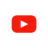
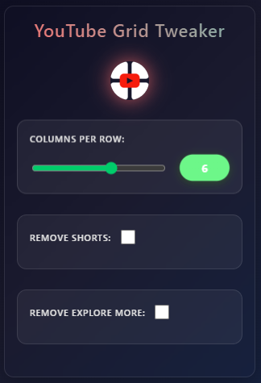

# 🎬 YouTube Grid Tweaker

<div align="center">



**A Chrome extension that lets you customize YouTube's video grid layout and remove unwanted content**

[](https://chrome.google.com/webstore)
[](https://github.com/filip-h-999/youtube-grid-tweaker/releases)
[](https://opensource.org/licenses/MIT)
</div>

---

## 🚀 Quick Overview

YouTube Grid Tweaker transforms your YouTube browsing experience by giving you complete control over how videos are displayed. Customize the number of video in a row, remove distracting content like Shorts, and enjoy a cleaner, more personalized YouTube interface.

### ⚡ Key Features

| Feature                  | Description                                     |
| ------------------------ | ----------------------------------------------- |
| 🎛️ **Grid Control**      | Adjust video columns from 3-8 per row           |
| 🚫 **Content Filtering** | Remove Shorts and "Explore More" sections       |
| 💾 **Smart Memory**      | Settings persist across browser sessions        |
| 🎨 **Modern UI**         | Beautiful glassmorphism design with animations  |
| ⚡ **Real-time**         | Instant changes without page refresh            |
| 🌐 **Universal**         | Works on all YouTube pages (home, subs, search) |

## 📸 Screenshots

<div align="center">

### Extension Interface



</div>

## Installation

1. **Download**: Clone or download this repository

   ```bash
   git clone https://github.com/filip-h-999/youtube-grid-tweaker.git
   ```

2. **Install**:

   - Open Chrome → `chrome://extensions/`
   - Enable "Developer mode"
   - Click "Load unpacked" → Select the extension folder

3. **Use**: Click the extension icon on any YouTube page!

## 📖 How to Use

1. **Navigate** to YouTube.com
2. **Click** the extension icon in your toolbar
3. **Adjust** the slider to change columns (3-8)
4. **Toggle** checkboxes to filter content
5. **Enjoy** your customized YouTube experience!

## 📄 License

This project is licensed under the MIT License - see the [LICENSE](LICENSE) file for details.

<div align="center">

**Made with ❤️ for the YouTube community**

⭐ **Star this repository if you found it helpful!** ⭐

</div>
