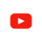
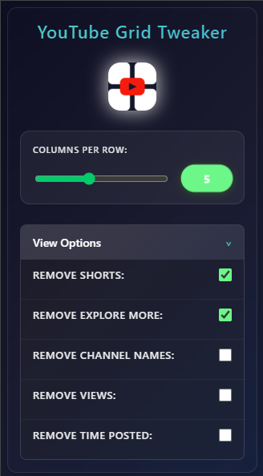

# 🎬 YouTube Grid Tweaker

<div align="center">



**A Chrome extension that lets you customize YouTube's video grid layout and remove unwanted content**
[](https://github.com/filip-h-999/youtube-grid-tweaker/stargazers)
[](https://github.com/filip-h-999/youtube-grid-tweaker/releases)
[](https://opensource.org/licenses/MIT)

</div>

---

## 🚀 Quick Overview

YouTube Grid Tweaker transforms your YouTube browsing experience by giving you complete control over how videos are displayed. Customize the number of video in a row, remove distracting content like Shorts, and enjoy a cleaner, more personalized YouTube interface.

### ⚡ Key Features

| Feature                    | Description                                     |
| -------------------------- | ----------------------------------------------- |
| 🎛️ **Grid Control**        | Adjust video columns from 3-8 per row           |
| 🚫 **Remove Shorts**       | Hide Shorts from sidebar, sections, and shelves |
| 🔍 **Remove Explore More** | Clean up "Explore More" sections                |
| 👤 **Hide Channel Names**  | Remove channel names from video listings        |
| 👁️ **Hide View Counts**    | Remove view counts from videos                  |
| ⏰ **Hide Time Posted**    | Remove "X hours/days ago" timestamps            |
| 💾 **Smart Memory**        | Settings persist across browser sessions        |
| 🎨 **Modern UI**           | Beautiful glassmorphism design with animations  |
| ⚡ **Real-time Updates**   | Changes apply instantly without page refresh    |
| 🔄 **Dynamic Detection**   | Works with YouTube's dynamic content loading    |
| 🌐 **Universal Coverage**  | Works on all YouTube pages (home, subs, search) |

## 📷 Screenshot

| **Before** | **After** |
| :--------: | :-------: |
|  ![][b1]   |  ![][a1]  |

[b1]: assets/images/Screenshot-before.png
[a1]: assets/images/Screenshot-after.png

## Extension Interface

<div align="center">



</div>

## Installation

1. **Download**: Clone or download this repository

   ```bash
   git clone https://github.com/filip-h-999/youtube-grid-tweaker.git
   ```

2. **Install**:

   - Open Chrome → `chrome://extensions/`
   - Enable "Developer mode"
   - Click "Load unpacked" → Select the extension folder

3. **Use**: Click the extension icon on any YouTube page!

## 📖 How to Use

1. **Navigate** to YouTube.com
2. **Click** the extension icon in your toolbar
3. **Customize your experience**:
   - **Grid Layout**: Adjust the slider to change columns (3-8)
   - **Remove Shorts**: Toggle to hide all Shorts content
   - **Remove Explore More**: Toggle to hide "Explore More" sections
   - **Hide Channel Names**: Toggle to hide channel names from videos
   - **Hide Views**: Toggle to hide view counts
   - **Hide Time Posted**: Toggle to hide "X hours/days ago" timestamps
4. **Restore content**: Simply uncheck any option to bring content back
5. **Enjoy** your customized YouTube experience!

> **Note**: Some features (Shorts, Explore More) require a page refresh to restore, while others (Channel Names, Views, Time Posted) can be toggled on/off instantly.

## 📄 License

This project is licensed under the MIT License - see the [LICENSE](LICENSE) file for details.

<div align="center">

**Made with ❤️ for the YouTube community**

⭐ **Star this repository if you found it helpful!** ⭐

</div>
