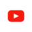
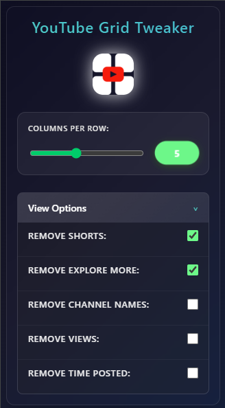

# 🎬 YouTube Grid Tweaker

<div align="center">



**A browser extension that lets you customize YouTube's video grid layout and remove unwanted content**
[](https://github.com/filip-h-999/youtube-grid-tweaker/stargazers)
[](https://github.com/filip-h-999/youtube-grid-tweaker/releases)
[](https://opensource.org/licenses/MIT)
[](https://chrome.google.com/webstore/detail/bmabdnjhhbljnmgcoifkeehkcjfhjjif)

</div>

---

## 🚀 Quick Overview

YouTube Grid Tweaker transforms your YouTube browsing experience by giving you complete control over how videos are displayed. Customize the number of videos in a row, remove distracting content like Shorts, and enjoy a cleaner, more personalized YouTube interface.

### ⚡ Key Features

| Feature                        | Description                                       |
| ------------------------------ | ------------------------------------------------- |
| 🎛️ **Grid Control**            | Adjust video columns from 3-8 per row             |
| 🚫 **Remove Shorts**           | Hide Shorts from sidebar, sections, and shelves   |
| 🔍 **Remove Explore More**     | Clean up "Explore More" sections                  |
| 🧭 **Remove Most Relevant**    | Hide "Most Relevant" shelf sections               |
| ⭐ **Remove YouTube Featured** | Hide "YouTube Featured" sections                  |
| 💾 **Smart Memory**            | Settings persist across browser sessions          |
| 🎨 **Modern UI**               | Beautiful glassmorphism design with animations    |
| ⚡ **Real-time Updates**       | Changes apply instantly without page refresh      |
| 🔄 **Dynamic Detection**       | Works with YouTube's dynamic content loading      |
| 🌐 **Universal Coverage**      | Works on all YouTube pages (home, subs, search)   |
| 🌍 **Cross-Browser**           | Tested on Chrome & Firefox, compatible with Edge+ |

## 📷 Screenshot

| **Before** | **After** |
| :--------: | :-------: |
|  ![][b1]   |  ![][a1]  |

[b1]: assets/images/Screenshot-before.png
[a1]: assets/images/Screenshot-after.png

## Extension Interface

<div align="center">



</div>

## Installation

### Chrome & Chromium-based browsers (Edge, Brave, Opera, etc.)

> **Note**: Tested on Chrome. Edge, Brave, and Opera should work as they use the same engine, but haven't been fully tested.

1. **Download**: Clone or download this repository

   ```bash
   git clone https://github.com/filip-h-999/youtube-grid-tweaker.git
   ```

2. **Install**:
   - Open your browser's extensions page:
     - **Chrome**: `chrome://extensions/`
     - **Edge**: `edge://extensions/`
     - **Brave**: `brave://extensions/`
     - **Opera**: `opera://extensions/`
   - Enable "Developer mode"
   - Click "Load unpacked" → Select the extension folder

3. **Use**: Click the extension icon on any YouTube page!

### Firefox

1. **Download**: Clone or download this repository
2. **Install**:
   - Open Firefox → `about:debugging`
   - Click "This Firefox" → "Load Temporary Add-on"
   - Select the `manifest.json` file from the extension folder
3. **Use**: Click the extension icon on any YouTube page!

> **Note**: Firefox installation is temporary and will be removed when you restart the browser. For permanent installation, the extension would need to be packaged and signed.

## 📖 How to Use

1. **Navigate** to YouTube.com
2. **Click** the extension icon in your browser toolbar
3. **Customize your experience**:
   - **Grid Layout**: Adjust the slider to change columns (3-8)
   - **Remove Shorts**: Toggle to hide all Shorts content
   - **Remove Explore More**: Toggle to hide "Explore More" sections
   - **Remove Most Relevant**: Toggle to hide "Most Relevant" sections
   - **Remove YouTube Featured**: Toggle to hide "YouTube Featured" sections
4. **Restore content**: Simply uncheck any option to bring content back
5. **Enjoy** your customized YouTube experience!

> **Note**: Section-removal features (Shorts, Explore More, Most Relevant, YouTube Featured) require a page refresh to restore content after disabling.

> **Note**: `Hide Channel Names`, `Hide Views`, and `Hide Time Posted` are currently commented out in the popup UI. They are not removed from the codebase and can be re-enabled later.

## 📄 License

This project is licensed under the MIT License - see the [LICENSE](LICENSE) file for details.

<div align="center">

**Made with ❤️ for the YouTube community**

**Tested on Chrome & Firefox • Should work on Edge, Brave, Opera**

⭐ **Star this repository if you found it helpful!** ⭐

</div>
